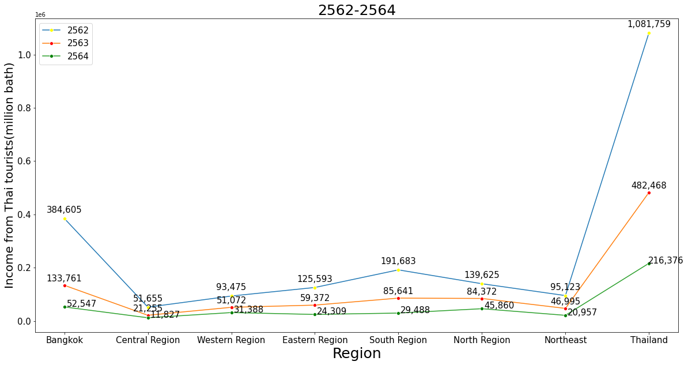

# Mini-project_DADS5001

## Topic : การเปลี่ยนแปลงของรายได้จากนักท่องเที่ยวชายไทยตั้งแต่ปี 2562 – 2564 

By : Kongpapon Sangrung (id : 6420412001) 

## Dataset :  
มีจำนวน 2,210 rows, 52 columns เป็นข้อมูลรายได้จากนักท่องเที่ยวชาวไทยตั้งแต่ปี 2562 – 2564 รวมทุกภูมิภาคในประเทศไทย และทุกเดือนภายในปี 2562 – 2564 source : https://data.go.th/dataset/stattourism?fbclid=IwAR30MqK-8hA743tKz8uBpPQ7cKyiYi8PKDiN7TImiEHHQYyQthLMTCGSBI4  

## Question & Answer :    

1.สรุปแนวโน้มรายได้จากนักท่องเที่ยวชาวไทยของปี 2563 – 2564 ช่วงไหนของทั้ง 2 ปี ที่ทำรายได้มากที่สุดและน้อยที่สุด.  
-ช่วงต้นปีนับตั้งแต่ ม.ค. – เม.ย. ทำรายได้จากนักท่องเที่ยวได้มากที่สุด ช่วงที่ทำรายได้น้อยที่สุดคือช่วงกลางปีนับตั้งแต่ พ.ค. - ส.ค.(เป็นช่วงที่เกิดวิกฤติ Covid-19)  
2.สรุปการเปลี่ยนแปลงรายได้จากนักท่องเที่ยวของปี 2562 เทียบกับปี 2563 – 2564 เดือนไหนที่มีการเปลี่ยนแปลงรายได้จากนักท่องเที่ยวชาวไทยมากที่สุด.  
-เดือนเมษายนมีการเปลี่ยนแปลงมากที่สุด และเป็นเดือนที่ศูนย์เสียรายได้จากนักท่องเที่ยวชาวไทยมากที่สุด(เนื่องจากปี 2562 เป็นช่วงก่อนเกิดวิกฤติ Covid-19)  
3.ในช่วงปี 2562 – 2564 ภูมิภาคไหนยังคงทำรายได้จากนักท่องเที่ยวชาวไทยได้มากที่สุดกับน้อยที่สุด และตั้งแต่ปี 2562 – 2564 สภาพการเปลี่ยนแปลงของรายได้ในแต่ละภูมิภาคเป็นอย่างไร.    
-ในช่วงปี 2562 – 2564 กทม. ทำรายได้มากที่สุด ส่วนภาคกลางทำรายได้น้อยที่สุด และรายได้จากนักท่องเที่ยวชาวไทยตั้งแต่ปี 2562 – 2564 มีสภาพการเปลี่ยนแปลงลดลงอย่างต่อเนื่องในทุกๆภูมิภาค(ซึ่งเห็นได้ชัดว่าวิกฤติ Covid-19 ส่งผลกระทบอย่างมากต่อรายได้)    

## Challenge : 

1.Dataset ที่นำมาใช้ต้อง clean data อย่างละเอียด.  
2.เมื่อ merge data แล้ว ยัง plot กราฟไม่เป็น ต้องนำไป transpose ก่อนหลังจากนั้นค่อย plot graph.  
3.ไม่สามารถทำให้ data ใน graph เป็นภาษาไทยได้.  
4.สามารถขยับตัวเลขในกราฟที่ซ้อนกันได้ แต่บางกราฟเมื่อขยับแล้วจะไม่สวยจึงไม่ได้ขยับตัวเลข.

  

  
